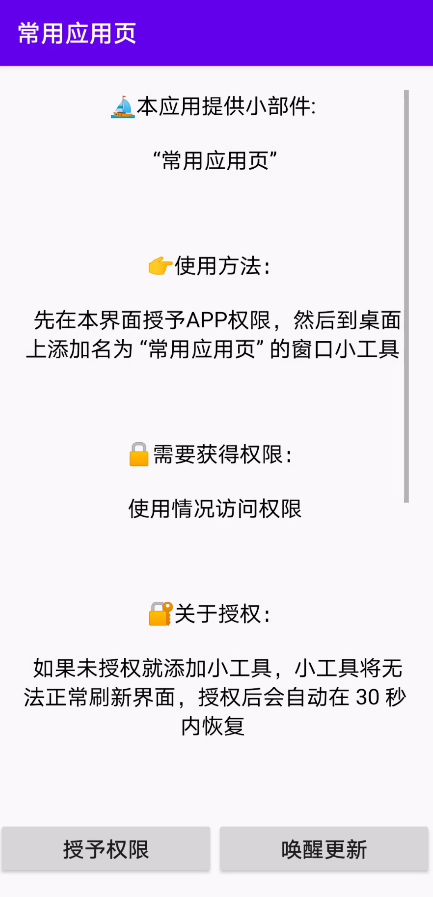
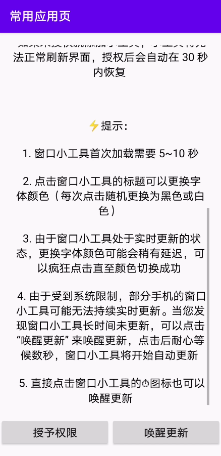
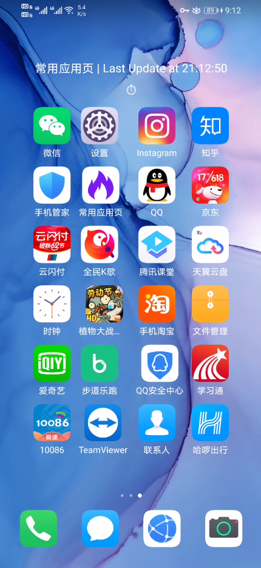

# HotApps  |  常用应用页

HotApps allows you to add a APP widget on your screen (Android only), which shows 24 APPs that you use most in the order of using frequency. 

This design is inspired by Microsoft Launcher.

- The APP widget will periodically update itself to reorder or replace the icons if needed.
- The title of the widget shows you the time of the last update.
- Click the icons, the corresponding App will launch.
- Click on the title or the ⏱ of the widget, the widget's text color will randomly change into black or white. Just click!
- Before you add the widget to the screen, don't forget to grant permission. Just click the left button in the APP.
- If you find the widget has not been updated for a long time, you can manually wake it up by clicking the right button in the APP.

“常用应用页”让你可以在手机桌面上添加小部件来显示你常用的应用。“常用应用页”小部件上展示了你手机上你最常用的24个APP，它们按照使用频率排序。

设计此应用的灵感来自于微软桌面（Microsoft Launcher）。

- 桌面小部件会周期性地自动更新，每次更新会重排或者替换24个APP。
- 桌面小部件的标题显示了最近一次更新的时间。
- 点击桌面小部件上的APP图标，相应的APP就会启动。
- 点击桌面小部件的标题或⏱图标，桌面小部件的字体颜色就会随机变成黑色或白色。疯狂点击吧！
- 在向手机桌面添加桌面小部件前，不要忘记授予权限。你只需要点击APP中左下角的按钮。
- 如果你发现桌面小部件长时间未更新，可以手动唤醒其自动更新。你只需要点击APP中右下角的按钮。

